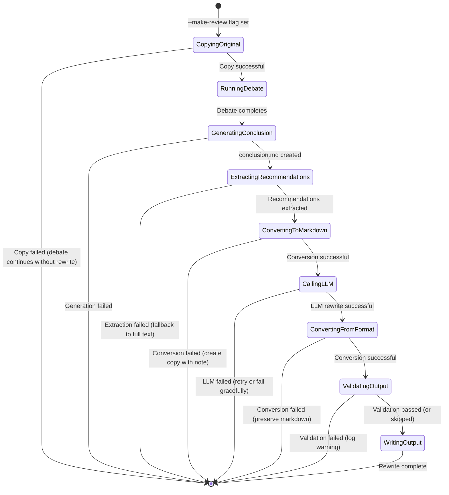

# Data Model: Document Rewrite Agent

**Feature**: 015-document-rewrite-agent
**Date**: 2026-02-17
**Phase**: Phase 1 - Design

## Overview

This document defines the data structures and contracts for the Document Rewrite Agent feature.

## Core Entities

### RewriteRequest

Input parameters for the rewriter agent.

```python
@dataclass
class RewriteRequest:
    """Request to rewrite a document based on debate conclusions."""

    # Input files
    original_document_path: str      # Path to original document (copy in run-id dir)
    conclusion_path: str             # Path to conclusion.md

    # Output configuration
    output_directory: str            # Run-id directory
    original_filename: str           # Original filename (e.g., "prd.docx")

    # Processing options
    format: DocumentFormat           # .docx, .md, .txt
    model_config: LLMConfig          # LLM configuration (reuse from debate)

    # Validation
    validate_recommendations: bool = True  # Whether to validate all recommendations applied
```

### RewriteResult

Output from the rewriter agent.

```python
@dataclass
class RewriteResult:
    """Result from document rewriting operation."""

    # Status
    success: bool
    error_message: Optional[str]     # None if success

    # Output files
    rewritten_document_path: str     # Path to rewritten document

    # Metadata
    recommendations_count: int       # Number of recommendations found
    recommendations_applied: int     # Number of recommendations applied
    inline_notes_count: int         # Number of <!-- REVIEW NOTE: --> added

    # Timing
    processing_time_seconds: float

    # Validation (if enabled)
    validation_passed: bool
    validation_details: Optional[str]
```

### ConversionResult

Result from format converter operations.

```python
@dataclass
class ConversionResult:
    """Result from format conversion (to/from markdown)."""

    success: bool
    error_message: Optional[str]

    # Content
    markdown_content: Optional[str]  # Converted markdown (if to_markdown)
    original_content: Optional[bytes]  # Original binary content (if from_markdown)

    # Metadata
    metadata_preserved: Dict[str, Any]  # Preserved metadata from source
    formatting_warnings: List[str]      # List of formatting issues
```

### Recommendation

Parsed recommendation from conclusion report.

```python
@dataclass
class Recommendation:
    """A single recommendation extracted from conclusion.md."""

    # Identification
    section_reference: Optional[str]  # e.g., "Section 3.2" or None if global

    # Action
    action_type: ActionType          # REMOVE, UPDATE, ADD, REPLACE, RESTRUCTURE
    target_content: Optional[str]    # Content to target (for UPDATE/REPLACE)
    new_content: Optional[str]       # New content (for UPDATE/ADD/REPLACE)

    # Context
    priority: int                    # 1-5, where 1 is highest
    rationale: Optional[str]         # Why this change is recommended
```

```python
class ActionType(Enum):
    """Types of recommendation actions."""
    REMOVE = "remove"                # Remove section/content
    UPDATE = "update"                # Update existing content
    ADD = "add"                      # Add new content
    REPLACE = "replace"              # Replace one thing with another
    RESTRUCTURE = "restructure"      # Restructure document organization
```

### FileMetadata

Preserved metadata from source file.

```python
@dataclass
class FileMetadata:
    """Metadata preserved from source file."""

    # File identification
    original_path: str
    original_filename: str
    original_extension: str

    # Timestamps (ISO 8601 format)
    created_at: Optional[str]        # When original was created
    modified_at: Optional[str]       # When original was last modified
    copied_at: str                   # When copy was made (current time)

    # Author/ownership (if available)
    author: Optional[str]

    # File stats
    size_bytes: int

    # Document-specific metadata (for .docx)
    doc_properties: Optional[Dict[str, Any]]  # Title, Subject, Keywords, etc.
```

### DocumentFormat

Supported document formats.

```python
class DocumentFormat(Enum):
    """Supported document formats for rewriting."""
    DOCX = "docx"        # Word document
    MARKDOWN = "md"      # Markdown file
    TEXT = "txt"         # Plain text
    RTF = "rtf"          # Rich Text Format (future)

    @classmethod
    def from_extension(cls, extension: str) -> 'DocumentFormat':
        """Get format from file extension."""
        mapping = {
            'docx': cls.DOCX,
            'md': cls.MARKDOWN,
            'txt': cls.TEXT,
            'rtf': cls.RTF,
        }
        return mapping.get(extension.lower(), cls.MARKDOWN)

    def supports_markdown_intermediate(self) -> bool:
        """Whether this format supports markdown as intermediate format."""
        return self in [self.DOCX, self.MARKDOWN, self.TEXT]
```

## Supporting Types

### LLMConfig

LLM configuration (reuse existing from project).

```python
@dataclass
class LLMConfig:
    """LLM configuration for rewriter agent."""

    model_name: str                  # e.g., "gpt-4", "gpt-3.5-turbo"
    temperature: float = 0.7         # Creativity (lower = more deterministic)
    max_tokens: int = 4096          # Max tokens in response

    # Provider configuration
    provider: str = "openai"         # openai, azure, zhipu, etc.
    api_key: Optional[str] = None    # Loaded from environment
```

### RewriteOptions

Options for controlling rewrite behavior.

```python
@dataclass
class RewriteOptions:
    """Options for document rewriting."""

    # Processing
    aggressive_mode: bool = True     # Apply all recommendations aggressively
    resolve_contradictions: bool = True  # Resolve without asking user

    # Output control
    preserve_formatting: bool = True # Try to preserve original formatting
    add_inline_notes: bool = True    # Add <!-- REVIEW NOTE: --> when needed

    # Validation
    validate_completeness: bool = True  # Check all recommendations applied

    # Fallback
    fallback_on_error: bool = True   # Create copy with note if rewrite fails
```

## State Transitions



## Error States

### RewriteError

Base exception for rewrite errors.

```python
class RewriteError(Exception):
    """Base exception for rewrite errors."""

    def __init__(self, message: str, recoverable: bool = True):
        self.message = message
        self.recoverable = recoverable  # Whether operation can continue
        super().__init__(message)
```

### Specific Error Types

```python
class FileNotFoundError(RewriteError):
    """Original document or conclusion not found."""
    recoverable = False

class ConversionError(RewriteError):
    """Format conversion failed."""
    recoverable = True

class LLMError(RewriteError):
    """LLM call failed."""
    recoverable = True

class ValidationError(RewriteError):
    """Recommendation validation failed."""
    recoverable = True  # Can still output result with warning

class WriteError(RewriteError):
    """Failed to write output file."""
    recoverable = False
```

## File Naming Convention

Output files follow this naming pattern:

```
{original_name}_{YYYYMMDD_HHMMSS}.{extension}
```

Examples:
- `prd.docx` → `prd_20260217_123456.docx`
- `document.md` → `document_20260217_123456.md`
- `notes.txt` → `notes_20260217_123456.txt`

Timestamp uses UTC timezone.

## Relationships

```
RewriteRequest
    ├── uses → DocumentFormat
    ├── uses → LLMConfig
    └── creates → RewriteResult

RewriteResult
    ├── contains → List[Recommendation]
    ├── references → FileMetadata
    └── validates → ConversionResult

ConversionResult
    └── preserves → FileMetadata
```

---

**Data Model Status**: Complete
**Next**: Generate contracts and quickstart guide
